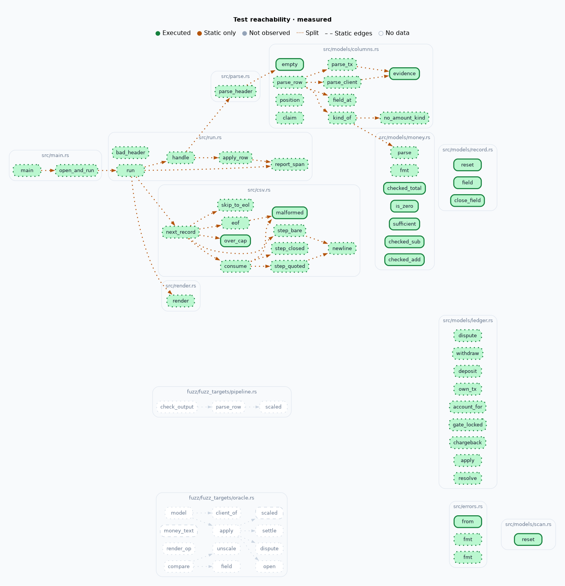

# payments

Toy payments engine. Reads a transactions CSV, applies deposits, withdrawals,
disputes, resolves and chargebacks, writes final account balances to stdout.

```
cargo run -- transactions.csv > accounts.csv
```

Rejected rows go to stderr as `line <n>: <error>` and do not change the exit
code. Exit 1 is reserved for failures that kill the run (unreadable input,
missing header, unterminated quote, a full disk). Exit 2 is a usage error.

std only, zero runtime dependencies — `cargo tree --edges normal` is one node.
proptest and allocation-counter are dev-dependencies.

## Verify

```
cargo fmt --check
cargo clippy --all-targets -- -D warnings
cargo test                 # 104 tests
```

## Calls the spec does not make

The exercise text is not in this repo, so "the spec" below is cited, not shipped.

The spec is silent on each of these. Every one is a deliberate ruling, numbered
in WCGW.md, and pinned by the named test.

| # | Call | Pinned by |
| --- | --- | --- |
| 47 | Withdrawals are **not** disputable. Only deposits are. A chargeback on a withdrawal is meaningless to the bank — the funds already left, and reversing it hands a fraudster free money. | `dispute_on_withdrawal_rejected_wcgw47` |
| 8 | A deposit chargeback removes funds: held and total fall. | `wcgw8_deposit_chargeback_removes_funds_and_locks` |
| 43 | A chargebacked tx id is burned forever. The record stays as a tombstone so id reuse is still `DuplicateTx`. Evicting it would reopen the id exactly where fraud cleanup happened. | `chargebacked_id_stays_burned_forever` |
| 45 | Locked is absolute. Every later row is rejected, including resolve on a dispute still open at lock time — those held funds stay held forever. | `wcgw30_locked_account_held_funds_stay_held_forever` |
| 22 | A second deposit/withdrawal reusing any seen tx id is rejected. | `wcgw22_duplicate_tx_id_rejected` |
| 44 | A well-formed row creates its client on sight, so a rejected duplicate deposit still yields a zero row. A malformed row names nobody. | `bad_amount_never_names_a_client` |
| 5 | Zero-amount rows are recorded, but disputing one is rejected — a chargeback of nothing would lock an account over 0.0000. | `wcgw5_zero_amount_tx_recorded_but_not_disputable` |
| 7, 9 | Available may go negative when spent funds are disputed. Not clamped: the liability stays visible. | `wcgw7_dispute_on_spent_funds_shows_negative_available` |
| 2 | Padding past 4dp is fine (`1.50000`), a nonzero digit past the 4th is rejected, never rounded. | `wcgw2_nonzero_past_four_decimals_rejected_zero_padding_accepted` |
| 4 | Signed amounts (`-5.0`, `+1.0`) are malformed. A negative deposit is a withdrawal in costume. | `wcgw4_rejects_signed_amount` |
| 6, 54 | Overflow is a rejected row, never a wrap. A row that would make `available + held` unrepresentable is rejected at apply time, so the total column always holds a number. | `dispute_at_i64_max_rejects_unrepresentable_total_wcgw51` |
| 55 | A rejected row moves no money. Both legs and the total invariant are computed before either is assigned. | `rejected_dispute_moves_no_money` |
| 46 | The header is mandatory and **drives** column mapping, in any order, case-insensitively. Unknown, duplicate or missing columns are fatal. A positional parser would silently misbook funds on a reordered partner file. | `reordered_header_remaps_columns`, `header_missing_a_column_is_fatal_wcgw46` |
| 12 | An empty file is zero clients (bare header, exit 0). A non-empty file whose first row is not a valid header is fatal. | `wcgw46_empty_file_is_valid_zero_clients` |
| 48, 49 | Input is real RFC-4180: quoted fields may hold commas, `""` escapes and newlines, so one record can span several physical lines. Report line numbers stay physical — `line N-M`. | `multiline_quote_span_reports_span_wcgw49` |
| 52, 56 | A quote is structural only when it opens a field, and must wrap the whole field. Spaces around fields are partner padding (the spec's own sample is `deposit, 1, 1, 1.0`), but a quote mid-content is malformed. | `quote_must_wrap_the_whole_field_wcgw52` |
| 50 | A quote opened and never closed is a broken file: fatal, no partial output. Guessing where it ends is a lie. | `unterminated_quote_at_eof_is_broken_file_wcgw50` |
| 19 | Non-UTF-8 bytes poison one record, not the file. | `wcgw19_bad_utf8_poisons_one_line_only` |
| 40 | An overlong record is capped, drained and reported, and the drain is quote-aware so a size cap never escalates into a file-level fatal. | `record_cap_inside_open_quote_drains_whole_record_wcgw40` |
| 39 | Output is sorted by client id. The spec permits any order; determinism is free and makes diffing possible. | `wcgw39_output_sorted_by_client_for_determinism` |
| 57 | A reader closing the pipe (`\| head -1`) is not our failure: exit 0, silent. A full device is: exit 1, loud. | `binary_reader_leaving_early_is_not_our_failure_wcgw34`, `binary_full_device_at_final_flush_is_fatal_wcgw34` |
| 36 | A write failure on the report sink is fatal — a diagnostic nobody can see is a bug. | `wcgw34_broken_output_sink_is_fatal_error` |

## How correctness is checked

- **An independent model.** `tests/oracle.rs` replays random op sequences
  through proptest against a model written from the rules above in `i128`, and
  compares every account. Self-consistency (`total == available + held`) is not
  an oracle: it passes on a ledger that lost every deposit.
- **Small id pools on purpose** (clients 0..4, txs 0..8). With random `u16` ids
  a dispute almost never names a real tx, the state machine is never reached,
  and the suite proves nothing while looking thorough.
- **Allocation is measured, not claimed.** `tests/allocs.rs` asserts 8000 extra
  rejected rows cost exactly 0 allocations.
- **Fuzzing** (`fuzz/`, nightly, dev-only) covers the byte-level input space
  proptest does not reach.

## Efficiency

Records stream through one reused byte buffer; the row path allocates nothing
per row. Only the ledger maps grow, which disputes require (#38). The engine
speaks `impl BufRead` / `impl Write` and never names `File` or `TcpStream`, so
the caller owns transport and concurrency (#42).

## What it knowingly does not do

- **No concurrency.** Single-threaded by design; the engine owns no transport.
- **The transactions map is unbounded.** A dispute can arrive at any time and
  burned ids must stay, so nothing is evictable. Memory grows with row count.
- **Amounts are `i64` scaled by 10_000.** Beyond ~9.2e14 units a row is
  rejected rather than widened.
- **No recovery from a malformed header.** The file is refused whole.
- **Row errors are reported, never retried or queued.**

## Coverage

`./coverage.sh` (local tooling, gitignored) writes a reachability map.



**What it proves:** every production function executes under the suite — 0
not-observed, down from 1 after an unused `From<RowError>` impl was deleted.
The grey clusters are fuzz targets, which `cargo test` does not run.

**What it does not prove:** branch and path coverage are unassessed. 22
functions still have unexecuted regions (`parse_header` 55/65, `skip_to_eol`
30/38), so an arm can be green at function level and never taken. Region counts
prove a line ran, not that a test would fail if it were wrong. The static edge
map has ~1000 blind spots (method dispatch, macros), so "no path found" never
means "untested". There is no per-test attribution.
